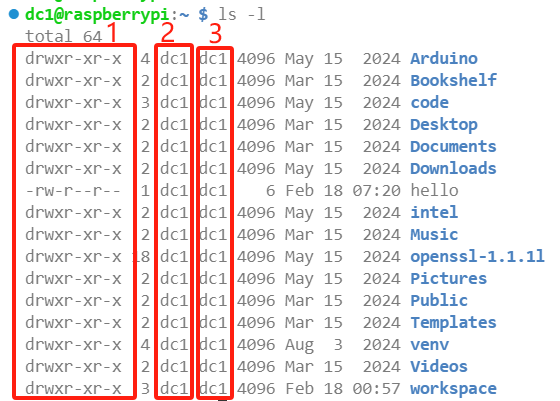
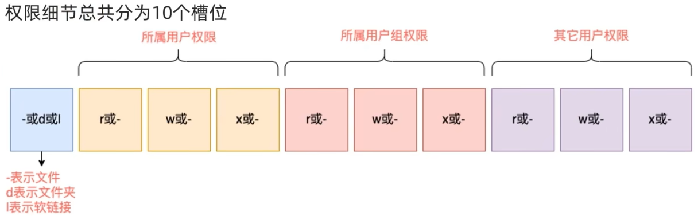

### 第二章：Linux 的 root 用户与用户管理

#### 1. Linux 的超级管理员用户
- Linux 的超级管理员用户是 root 用户。
- root 用户拥有最大的权限，例如 root 用户可以在根目录下创建文件夹，而普通用户则没有这个权限。

#### 2. su 命令
```
su [-] 用户名
```
- **作用**：切换用户。
- **选项**：`-` 表示是否在用户切换后加载环境变量，建议带上。
- **参数**：用户名，如果不写，则默认是 root 用户。
- **注意**：root 用户切换到普通用户不需要输入密码，而普通用户切换到 root 用户需要密码。
- **退回操作**：切换用户后使用 `exit` 退回上一个用户，也可以使用快捷键 `ctrl + d`。
- **举例**：`su - root`

#### 3. sudo 命令
```
sudo
```
- **作用**：临时获得 root 用户的权限。
- **使用方法**：在使用其他指令时，开头加上 sudo，即表示使用最大权限执行该命令。
- **举例**：`sudo mkdir /try`

### 用户和用户组

#### 1. 概念
- Linux 系统中可以配置多个用户和用户组。
- Linux 针对用户和用户组有不同的权限管控。

#### 2. groupadd 和 groupdel 命令
- **groupadd 命令**：用于创建用户组，格式为 `groupadd 用户组名`，例如 `groupadd try`。
- **groupdel 命令**：用于删除用户组，格式为 `groupdel 用户组名`，例如 `groupdel try`。
- **注意**：这两条指令均需要获得 root 权限。

#### 3. 用户管理

##### 创建用户
```
useradd [-g -d -m] 用户名
```
- **选项说明**：
    - `-g`：指定用户的组，不指定，则默认创建同名组，指定 `-g` 时，需确保组已存在，若已存在同名组，则必须使用 `-g`。
    - `-d`：指定用户的 HOME 路径，不指定，则默认创建在：`/home/用户名`。
    - `-m`：表示强制建立用户的 HOME 路径。
- **举例**：创建一个名为 try 的用户 `useradd -m try`。

##### 删除用户
```
userdel [-r] 用户名
```
- **选项**：`-r`，删除用户的 HOME 目录，不使用 `-r` 时，需要手动删除。
- **举例**：删除名为 try 的用户以及其 HOME 目录，`userdel -r try`。

##### 查看用户的信息
```
id [用户名]
```
- **参数**：用户名，被查看的用户，不填写则默认查看自身。
- **举例**：查看 try 用户的信息 `id try`。

##### 修改用户所属用户组
```
usermod -aG 用户组名 用户名
```
- **作用**：将指定用户添加到指定的用户组里。
- **举例**：将 try 用户添加到 test 用户组里，`usermod -aG test try`。

##### 查看当前系统里有哪些用户
```
getent passwd
```
- **输出信息**：输出的信息分别是：密码，用户 id，组 id，描述信息，HOME 目录，执行终端。

#### 4. 权限信息

##### 权限信息的查看

- 序号 1 代表文件的权限控制信息。
- 序号 2 代表文件的用户名。
- 序号 3 代表文件的用户组名。
- 这些信息可以通过 `ls -l` 命令查看。

##### 权限信息的认知

- 权限信息共分为 10 个槽位，第一个代表文件类型，`-` 代表文件，`d` 代表文件夹，`l` 代表软链接。
- 第 2 到 4 这三个槽位是用户所属权限。
- 第 5 到 7 这三个是所属用户组的权限。
- 第 8 到 10 这三个是其他用户的权限。
- 其中：
    - 第一项代表了可读权限，`r` 表示可读，`-` 表示不可读，例如查看文件夹内容。
    - 第二项代表了可写权限，`w` 表示可写，`-` 表示不可写，例如文件夹内创建、修改、删除等。
    - 第三项代表了可执行权限，`x` 表示可执行，`-` 表示不可执行，例如 `cd` 命令。

#### 5. chmod 命令
```
chmod [-R] 权限 文件或文件夹路径
```
- **作用**：使用 chmod 命令修改文件的权限信息。
- **选项**：`-R`，表示对文件夹内的所有内容都执行修改权限的操作。
- **参数**：权限分别为 `rwx`。
- **示例**：将 try 文件的权限修改为 `-rwxr - xr--`，`chmod u=rwx,g=rx,o=r try`，其中 `u` 代表用户，`g` 代表用户组，`o` 代表其他用户。
- **注意**：使用 chmod 命令时，只有 root 用户和文件所属用户可以。
- **权限数字表示法**：
    - 第一位数字代表用户权限，第二位代表用户组权限，第三位代表其他用户权限。
    - 数字的细节如下：

| 数字 | 权限 | 对应符号 |
| ---- | ---- | ---- |
| 0 | 无任何权限 | --- |
| 1 | 可执行 | --x |
| 2 | 可写 | -w- |
| 3 | 可写和可执行 | -wx |
| 4 | 可读 | r-- |
| 5 | 可读和可执行 | r - x |
| 6 | 可读和可写 | rw - |
| 7 | 可读、可写和可执行 | rwx |

- **举例**：刚才的 `chmod u=rwx,g=rx,o=r try` 可表示为 `chmod 754 try`。

#### 6. chown 命令
```
chown [-R] [用户] [:] [用户组] 文件或文件夹
```
- **作用**：修改文件的所属用户和所属组。
- **选项说明**：
    - `-R`：将文件夹内的所有内容都一起修改。
    - 用户：修改所属用户。
    - 用户组：修改所属用户组。
    - `:`：用于分隔用户和用户组。
- **示例**：
    - 将 try 文件的用户修改为 root：`chown root try`。
    - 将 try 文件内的所有内容的用户和用户组都修改为 root，`chown root:root try`。
- **注意**：这个命令必须要 root 权限。
